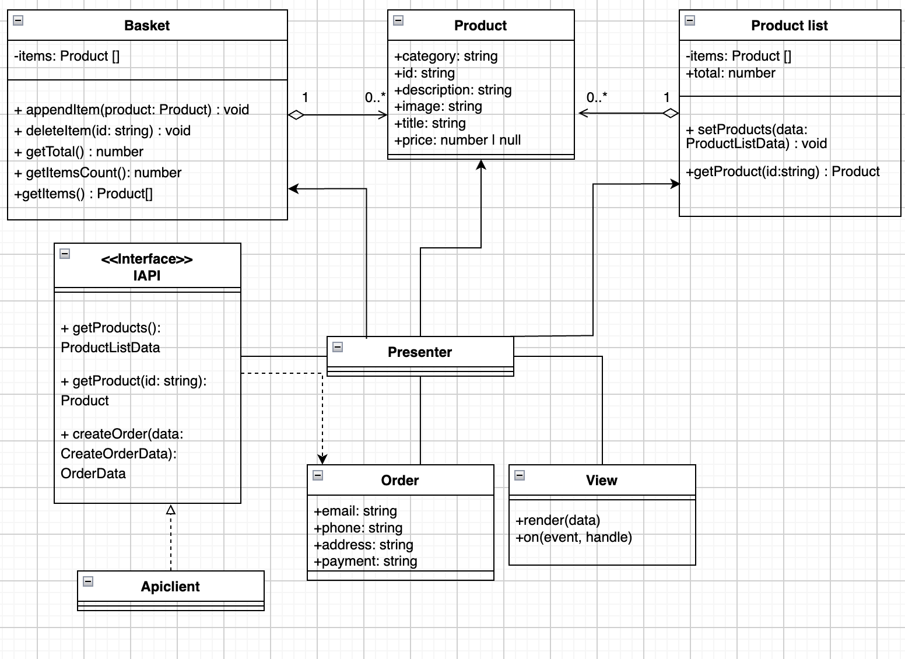

# Проектная работа «Веб-ларёк»

Реализация интернет-магазина «Веб-ларёк» с каталогом товаров, корзиной и оформлением заказа.
Используемый стек: TypeScript, HTML, SCSS.
Для сборки используется Webpack.
Инструменты линтинга и форматирования: ESLint и Prettier.

## Инструкция по сборке и запуску

После клонирования проекта установить зависимости:

```bash
npm install
```

Для запуска проекта в режиме разработки выполнить команду:

```bash
npm run start
```

и открыть в браузере страницу по адресу http://localhost:8080
Для сборки проекта в продакшен выполнить команду:

```bash
npm run build
```

Для данного проекта нет ограничений по использованию пакетного менеджера, поэтому можно
использовать также YARN или PNPM.

## Архитектура



В проекте используется архитектурный паттерн MVP (Model — View — Presenter).

Model отвечает за хранение состояния приложения и бизнес-логику.

View отвечает за отображение данных и взаимодействие с пользователем.

Presenter координирует взаимодействие между Model, View и API, обрабатывая пользовательские сценарии приложения.

Для связи компонентов приложения через события используется брокер событий EventEmitter.
Взаимодействие с сервером осуществляется через API-клиент.

## Базовый код

### 1. Класс EventEmitter

Брокер событий, классическая реализация.

Используется для организации взаимодействия между компонентами приложения через события.

Класс реализует интерфейс IEvents.

Основные методы:

- on — установить обработчик на событие;
- off — снять обработчик с события;
- emit — инициировать событие с данными;
- onAll — подписаться на все события;
- offAll — сбросить все обработчики;
- trigger — создать callback, генерирующий событие при вызове.
  Для хранения обработчиков используется Map<EventName, Set<Subscriber>>.
  Поддерживаются строковые имена событий и регулярные выражения.
  Также предусмотрена возможность подписки на все события через специальное событие \*.

### 2. Класс Api

Базовый класс для взаимодействия с серверным API.
Класс хранит базовый URL сервера и настройки HTTP-запросов.
Основные методы:

- get — выполнение GET-запроса;
- post — выполнение POST-запроса, а также PUT и DELETE при передаче соответствующего метода;
- handleResponse — обработка ответа сервера.
  При успешном запросе handleResponse возвращает данные в формате JSON. При ошибке Promise отклоняется с сообщением об ошибке.

### 3. Класс ApiClient

Отвечает за взаимодействие приложения с API интернет-магазина.
Класс реализует интерфейс IAPI.
Основные операции:

- получение списка товаров;
- получение отдельного товара;
- создание заказа.

## Компоненты модели данных (бизнес-логика)

### 1. Класс Product

Содержит данные отдельного товара.
Основные свойства:

- id — идентификатор товара;
- description — описание товара;
- image — изображение товара;
- title — название товара;
- category — категория товара;
- price — цена товара.

### 2. Класс ProductList

Отвечает за хранение и управление каталогом товаров.
Содержит список товаров и общее количество товаров в каталоге.
Основные методы:

- setProducts — установка списка товаров;
- getProduct — получение товара по идентификатору.

### 3. Класс Basket

Отвечает за состояние корзины и работу с товарами.
Основные методы:

- appendItem — добавление товара в корзину;
- deleteItem — удаление товара;
- getItems — получение списка товаров;
- getTotal — получение общей стоимости;
- getItemsCount — получение количества товаров.
  В корзине один товар может находиться только один раз.

### 4. Класс Order

Содержит данные покупателя, необходимые для оформления заказа.
Основные свойства:

- payment — способ оплаты;
- email — электронная почта;
- phone — номер телефона;
- address — адрес доставки.
  Данные корзины и итоговая стоимость используются при формировании запроса на сервер.

## Компоненты представления

Представление отвечает за отображение данных и взаимодействие с пользователем.

### 1. Класс View

Отвечает за отображение данных в интерфейсе и передачу пользовательских событий.
Основные операции:

- render — отображение данных;
- on — подписка на пользовательское событие.
  Через события View сообщает Presenter о действиях пользователя:
- добавлении товара в корзину;
- удалении товара из корзины;
- оформлении заказа.

### Ключевые типы данных

```ts
// HTTP-методы, которые используются для запросов с телом
type ApiPostMethods = 'POST' | 'PUT' | 'DELETE';

// Данные события брокера событий
type EmitterEvent = {
	eventName: string; // название события
	data: unknown; // данные, переданные вместе с событием
};

// Данные отдельного товара
interface Product {
	id: string; // идентификатор товара
	description: string; // описание товара
	image: string; // ссылка на изображение
	title: string; // название товара
	category: string; // категория товара
	price: number | null; // цена товара, может отсутствовать
}

// Ответ API со списком товаров
interface ProductListData {
	total: number; // общее количество товаров
	items: Product[]; // массив товаров
}

// Данные, отправляемые на сервер при создании заказа
interface CreateOrderData {
	payment: string; // способ оплаты
	email: string; // электронная почта покупателя
	phone: string; // номер телефона покупателя
	address: string; // адрес доставки
	total: number; // итоговая стоимость заказа
	items: string[]; // идентификаторы товаров в заказе
}

// Ответ сервера после создания заказа
interface OrderData {
	id: string; // идентификатор созданного заказа
	total: number; // итоговая стоимость заказа
}
```

## Размещение в сети

Рабочая версия приложения опубликована с использованием GitHub Pages.
Для публикации используется команда:

```bash
npm run deploy
```
